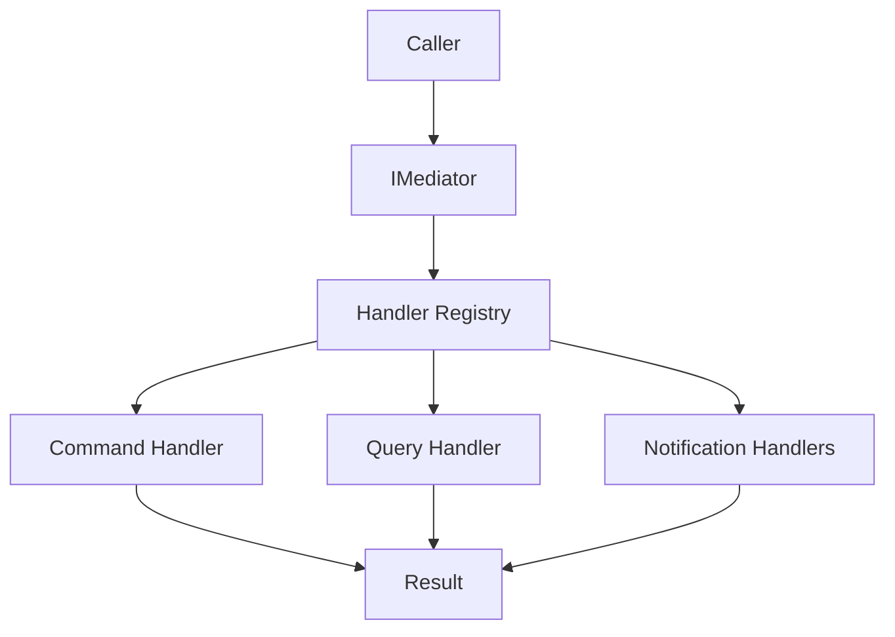

# Teqniqly.Arbiter

A lightweight, high-performance in-process mediator library for .NET that implements the Command Query Separation (CQS) pattern for modular monoliths.

## Table of Contents

- [The Problem](#the-problem)
- [The Solution](#the-solution)
- [Features](#features)
- [Getting Started](#getting-started)
- [Usage Examples](#usage-examples)
- [Performance](#performance)
- [Architecture](#architecture)
- [Documentation](#documentation)
- [License](#license)

## The Problem

In modular monoliths, direct module-to-module invocations create tight coupling and scatter cross-cutting concerns (validation, authorization, logging, transactions) throughout application code. This leads to:

- **Inconsistent Policies**: Auth, validation, and logging implemented differently across modules
- **Boilerplate Proliferation**: Repeating the same cross-cutting code everywhere
- **Testing Complexity**: Difficult to unit test due to coupled dependencies
- **Poor Observability**: No centralized point for monitoring request flow
- **Maintenance Burden**: Changes to cross-cutting policies require updates across many files

## The Solution

Teqniqly.Arbiter provides a centralized mediator that:

- Routes **Commands**, **Queries**, and **Notifications** to their handlers
- Enforces single-handler semantics for Commands/Queries
- Supports fan-out for Notifications (multiple handlers)
- Provides clean separation between application logic and cross-cutting concerns
- Offers excellent performance with zero reflection on the hot path
- Integrates seamlessly with Microsoft.Extensions.DependencyInjection

**Before (Direct Invocation):**

```csharp
public class OrderController : ControllerBase
{
    private readonly IOrderService _orderService;
    private readonly ILogger _logger;
    private readonly IValidator _validator;

    public async Task<IActionResult> CreateOrder(CreateOrderRequest request)
    {
        _logger.LogInformation("Creating order");

        var validationResult = await _validator.ValidateAsync(request);
        if (!validationResult.IsValid)
            return BadRequest(validationResult.Errors);

        var order = await _orderService.CreateAsync(request);

        _logger.LogInformation("Order created: {OrderId}", order.Id);
        return Ok(order);
    }
}
```

**After (Using Arbiter):**

```csharp
public class OrderController : ControllerBase
{
    private readonly IMediator _mediator;

    public async Task<IActionResult> CreateOrder(CreateOrderCommand command)
    {
        var orderId = await _mediator.Send(command);
        return Ok(orderId);
    }
}
```

All cross-cutting concerns (logging, validation, authorization, etc.) are handled by the mediator pipeline.

## Features

✅ **Type-Safe Dispatch**: Strongly-typed Commands, Queries, and Notifications  
✅ **Zero Reflection**: Prebuilt invokers for blazing-fast dispatch  
✅ **CQS Compliance**: Enforces Command Query Separation pattern  
✅ **Duplicate Detection**: Prevents accidental duplicate handler registration  
✅ **Custom Filtering**: TypeFilter option to control handler discovery  
✅ **DI Integration**: First-class support for Microsoft.Extensions.DependencyInjection  
✅ **Minimal Allocations**: ValueTask-based for reduced GC pressure  
✅ **Extensible**: Ready for pipeline behaviors (validation, caching, etc.)  
✅ **Well-Tested**: Comprehensive test coverage  
✅ **Benchmarked**: Performance metrics included

## Getting Started

### Installation

```bash
dotnet add package Teqniqly.Arbiter.Core
```

### Basic Setup

1.  **Define a Command and Handler:**

```csharp
using Teqniqly.Arbiter.Core.Abstractions;

// Command
public sealed record CreateOrderCommand(string CustomerId, decimal Amount)
    : ICommand<Guid>;

// Handler
public sealed class CreateOrderCommandHandler
    : ICommandHandler<CreateOrderCommand, Guid>
{
    private readonly IOrderRepository _repository;

    public CreateOrderCommandHandler(IOrderRepository repository)
    {
        _repository = repository;
    }

    public async ValueTask<Guid> Handle(
        CreateOrderCommand command,
        CancellationToken ct)
    {
        var order = new Order
        {
            Id = Guid.NewGuid(),
            CustomerId = command.CustomerId,
            Amount = command.Amount
        };

        await _repository.SaveAsync(order, ct);
        return order.Id;
    }
}
```

2.  **Register with DI:**

```csharp
using Teqniqly.Arbiter.Core.Extensions;

var builder = WebApplication.CreateBuilder(args);

// Register Arbiter and scan assemblies for handlers
builder.Services.AddArbiter(typeof(Program).Assembly);

var app = builder.Build();
```

3.  **Use in Your Code:**

```csharp
public class OrdersController : ControllerBase
{
    private readonly IMediator _mediator;

    public OrdersController(IMediator mediator)
    {
        _mediator = mediator;
    }

    [HttpPost]
    public async Task<IActionResult> CreateOrder(CreateOrderCommand command)
    {
        var orderId = await _mediator.Send(command);
        return Ok(new { orderId });
    }
}
```

## Usage Examples

### Commands

Commands represent intent to change state. Each command has exactly one handler.

```csharp
// Command
public sealed record UpdateOrderStatusCommand(Guid OrderId, string Status)
    : ICommand<bool>;

// Handler
public sealed class UpdateOrderStatusCommandHandler
    : ICommandHandler<UpdateOrderStatusCommand, bool>
{
    public async ValueTask<bool> Handle(
        UpdateOrderStatusCommand command,
        CancellationToken ct)
    {
        // Update order status logic
        return true;
    }
}

// Usage
var success = await _mediator.Send(
    new UpdateOrderStatusCommand(orderId, "Shipped"));
```

### Queries

Queries represent intent to retrieve data without side effects. Each query has exactly one handler.

```csharp
// Query
public sealed record GetOrderByIdQuery(Guid OrderId)
    : IQuery<Order>;

// Handler
public sealed class GetOrderByIdQueryHandler
    : IQueryHandler<GetOrderByIdQuery, Order>
{
    private readonly IOrderRepository _repository;

    public async ValueTask<Order> Handle(
        GetOrderByIdQuery query,
        CancellationToken ct)
    {
        return await _repository.GetByIdAsync(query.OrderId, ct);
    }
}

// Usage
var order = await _mediator.Ask(new GetOrderByIdQuery(orderId));
```

### Notifications

Notifications represent events that can have zero or more handlers (fan-out pattern).

```csharp
// Notification
public sealed record OrderCreatedNotification(Guid OrderId, string CustomerId)
    : INotification;

// Handler 1: Send email
public sealed class SendOrderConfirmationEmailHandler
    : INotificationHandler<OrderCreatedNotification>
{
    public async ValueTask Handle(
        OrderCreatedNotification notification,
        CancellationToken ct)
    {
        // Send confirmation email
        await Task.CompletedTask;
    }
}

// Handler 2: Update analytics
public sealed class UpdateOrderAnalyticsHandler
    : INotificationHandler<OrderCreatedNotification>
{
    public async ValueTask Handle(
        OrderCreatedNotification notification,
        CancellationToken ct)
    {
        // Update analytics dashboard
        await Task.CompletedTask;
    }
}

// Usage - both handlers are invoked
await _mediator.Publish(new OrderCreatedNotification(orderId, customerId));
```

### Advanced Configuration

#### Handler Lifetime Configuration

```csharp
builder.Services.AddArbiter(
    opts =>
    {
        // Set handler lifetime (default: Scoped)
        opts.HandlerLifetime = ServiceLifetime.Scoped;
    },
    typeof(Program).Assembly
);
```

#### Type Filtering

```csharp
builder.Services.AddArbiter(
    opts =>
    {
        // Only register handlers from specific namespaces
        opts.TypeFilter = t =>
            t.Namespace?.StartsWith("MyApp.Handlers") == true;
    },
    typeof(Program).Assembly
);
```

## Performance

Teqniqly.Arbiter is designed for high performance with minimal overhead:

### CPU Performance

| Operation                         | Mean Time | Allocated Memory |
| --------------------------------- | --------- | ---------------- |
| Send Command                      | ~100 ns   | 0 B              |
| Ask Query                         | ~100 ns   | 0 B              |
| Publish Notification (2 handlers) | ~200 ns   | 0 B              |
| Create Command Instance           | ~10 ns    | 64 B             |

_Note: Actual performance will vary based on handler complexity and system configuration._

### Memory Efficiency

- **Zero allocations** for dispatch (registry lookup + handler invocation)
- **ValueTask** usage minimizes GC pressure
- **Immutable registry** enables lock-free concurrent access
- **Prebuilt invokers** eliminate reflection overhead

For detailed benchmarks, see [Benchmarks Documentation](src/Teqniqly.Arbiter.Core.Benchmarks/README.md).

## Architecture

### Component Overview



### Key Components

- **IMediator**: Entry point for sending commands, asking queries, and publishing notifications
- **Handler Registry**: Fast lookup table built at startup (no runtime reflection)
- **Message Contracts**: Strongly-typed interfaces (ICommand, IQuery, INotification)
- **Handlers**: Application logic implementing ICommandHandler, IQueryHandler, INotificationHandler
- **Context Accessor**: Thread-safe message context (correlation IDs, user info, etc.)

### Design Principles

1.  **Single Responsibility**: Each handler does one thing well
2.  **Open/Closed**: Extend via new handlers, not modifications
3.  **Dependency Inversion**: Depend on abstractions (IMediator), not concrete implementations
4.  **CQS Compliance**: Clear separation between commands (write) and queries (read)
5.  **Zero Reflection**: All dispatch logic uses prebuilt delegates

## Documentation

- **[Benchmark Results](src/Teqniqly.Arbiter.Core.Benchmarks/README.md)**: Performance metrics

## Project Structure

```text
tq-arbiter/
├── src/
│   ├── Teqniqly.Arbiter.Core/          # Core library
│   ├── Teqniqly.Arbiter.Core.Tests/    # Unit tests
│   └── Teqniqly.Arbiter.Core.Benchmarks/ # Performance benchmarks
└── README.md                            # This file
```

## License

This project is licensed under the MIT License - see the [LICENSE](LICENSE) file for details.

## Acknowledgments

- Inspired by the mediator pattern and CQS principles
- Built with modern .NET best practices
- Designed for modular monolith architectures
