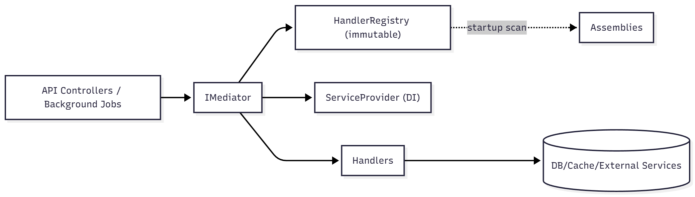
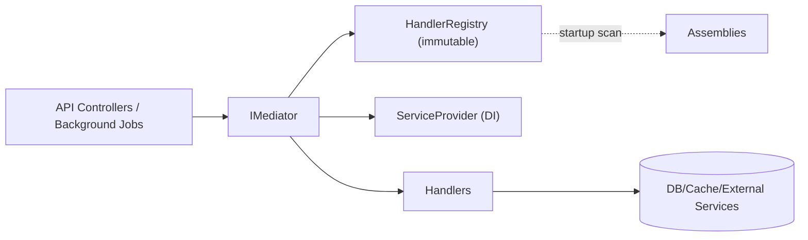
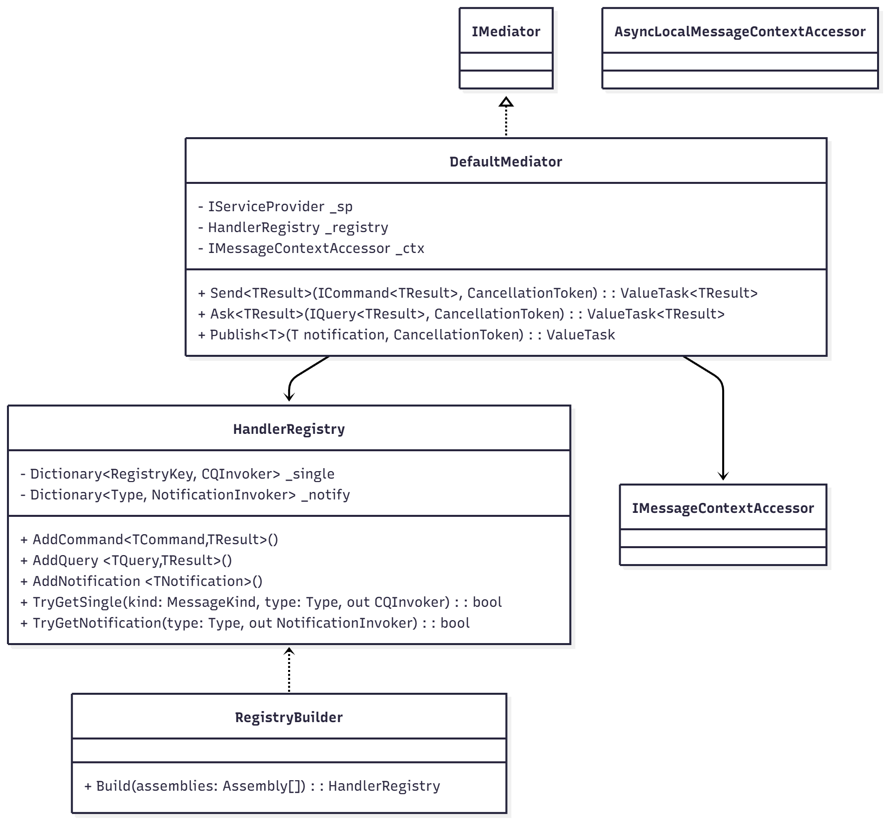
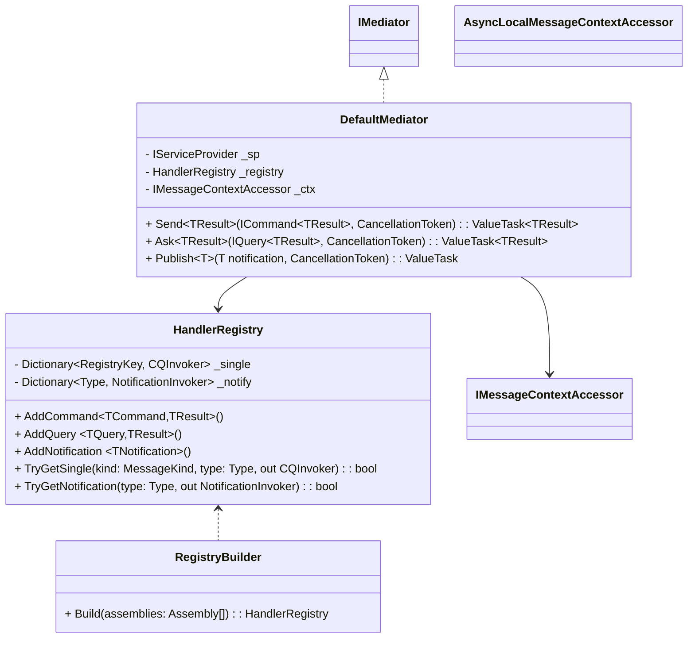
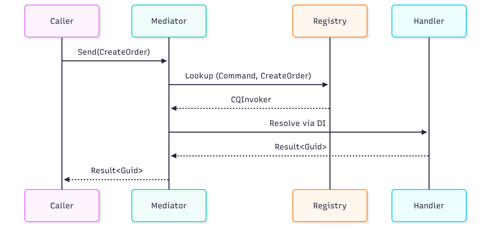
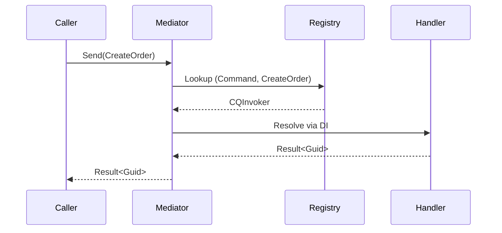
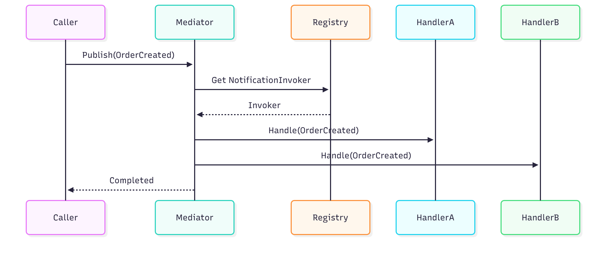
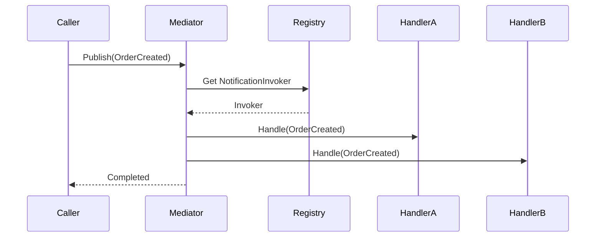

# Mediator Library — Core Mediator & Handler Registry Low‑Level Design (LLD)

**Version**: 1.0  
**Date**: 2025-11-28  
**Author**: Teqniqly
**Status**: Draft  
**Related Documents**: Mediator HLD, Milestone‑1 Design & Implementation Guide  
**Component Location**: `src/Teqniqly.Arbiter/Core`

## Document History

| Version | Date       | Author        | Changes         |
| ------- | ---------- | ------------- | --------------- |
| 1.0     | 2025-11-28 | Farooq Mahmud | Initial version |

---

## 1. Component Overview

### 1.1 Purpose

Provide the in‑process, synchronous dispatch mechanism for commands, queries, and notifications in a modular monolith. The component defines public contracts (messages/handlers), builds an immutable handler registry at startup, and dispatches messages through a minimal hot path (dictionary lookup → DI resolve → delegate invoke).

### 1.2 Scope

**In scope**: `IMediator`, `ICommand<>`, `IQuery<>`, `INotification`, handler interfaces, `DefaultMediator`, `HandlerRegistry`, one‑time assembly scanning (`RegistryBuilder`), `MessageContext` accessor, DI extensions, and basic options.  
**Out of scope**: pipeline behaviors (validation, auth, caching, idempotency, UoW), streaming queries, buffered/parallel publish; these land in later milestones.

### 1.3 Context Diagram





---

## 2. Detailed Design

### 2.1 Public Interfaces

```csharp
namespace ModMon.Mediator;

public interface IMediator
{
    ValueTask<TResult> Send<TResult>(ICommand<TResult> command, CancellationToken ct = default);
    ValueTask<TResult> Ask<TResult>(IQuery<TResult> query, CancellationToken ct = default);
    ValueTask Publish<TNotification>(TNotification notification, CancellationToken ct = default)
        where TNotification : INotification;
}

public interface ICommand<TResult> { }
public interface IQuery<TResult> { }
public interface INotification { }

public interface ICommandHandler<TCommand, TResult>
    where TCommand : ICommand<TResult>
{
    ValueTask<TResult> Handle(TCommand command, CancellationToken ct);
}

public interface IQueryHandler<TQuery, TResult>
    where TQuery : IQuery<TResult>
{
    ValueTask<TResult> Handle(TQuery query, CancellationToken ct);
}

public interface INotificationHandler<TNotification>
    where TNotification : INotification
{
    ValueTask Handle(TNotification notification, CancellationToken ct);
}
```

### 2.2 Supporting Types

```csharp
public readonly struct Unit { public static readonly Unit Value = new(); }

public sealed record Error(string Code, string Message, string? Detail = null);

public readonly record struct Result<T>(bool Success, T? Value, Error? Error)
{
    public static Result<T> Ok(T value) => new(true, value, null);
    public static Result<T> Fail(Error error) => new(false, default, error);
}

public sealed record MessageContext(
    string CorrelationId,
    string? CausationId,
    string? TenantId,
    string? UserId,
    string? IdempotencyKey,
    IReadOnlyDictionary<string, object?> Items);
```

#### Context Accessor (AsyncLocal)

```csharp
public interface IMessageContextAccessor
{
    MessageContext? Current { get; set; }
}

internal sealed class AsyncLocalMessageContextAccessor : IMessageContextAccessor
{
    private static readonly AsyncLocal<MessageContext?> _current = new();
    public MessageContext? Current { get => _current.Value; set => _current.Value = value; }
}

internal static class MessageContextDefaults
{
    public static MessageContext New() =>
        new(Guid.NewGuid().ToString("N"), null, null, null, null, new Dictionary<string, object?>());
}
```

### 2.3 Class Diagram





### 2.4 Internal Keys & Delegates

```csharp
internal enum MessageKind { Command, Query, Notification }
internal readonly record struct RegistryKey(MessageKind Kind, Type MessageType);

internal delegate ValueTask<object?> CQInvoker(IServiceProvider sp, object message, MessageContext ctx, CancellationToken ct);
internal delegate ValueTask NotificationInvoker(IServiceProvider sp, object message, MessageContext ctx, CancellationToken ct);
```

### 2.5 Static Invoker Builders (No Per‑Call Reflection)

```csharp
internal static class CommandInvoker<TCommand, TResult>
    where TCommand : ICommand<TResult>
{
    public static readonly CQInvoker Invoke =
        async (sp, msg, ctx, ct) =>
        {
            var h = sp.GetRequiredService<ICommandHandler<TCommand, TResult>>();
            return await h.Handle((TCommand)msg, ct);
        };
}

internal static class QueryInvoker<TQuery, TResult>
    where TQuery : IQuery<TResult>
{
    public static readonly CQInvoker Invoke =
        async (sp, msg, ctx, ct) =>
        {
            var h = sp.GetRequiredService<IQueryHandler<TQuery, TResult>>();
            return await h.Handle((TQuery)msg, ct);
        };
}

internal static class NotificationInvoker<TNotification>
    where TNotification : INotification
{
    public static readonly NotificationInvoker Invoke =
        async (sp, msg, ctx, ct) =>
        {
            foreach (var h in sp.GetServices<INotificationHandler<TNotification>>())
                await h.Handle((TNotification)msg, ct);
        };
}
```

### 2.6 HandlerRegistry (Immutable After Build)

```csharp
internal sealed class HandlerRegistry
{
    private readonly Dictionary<RegistryKey, CQInvoker> _single = new();
    private readonly Dictionary<Type, NotificationInvoker> _notify = new();

    public void AddCommand<TCommand, TResult>() where TCommand : ICommand<TResult>
        => _single[new(MessageKind.Command, typeof(TCommand))] = CommandInvoker<TCommand, TResult>.Invoke;

    public void AddQuery<TQuery, TResult>() where TQuery : IQuery<TResult>
        => _single[new(MessageKind.Query, typeof(TQuery))] = QueryInvoker<TQuery, TResult>.Invoke;

    public void AddNotification<TNotification>() where TNotification : INotification
        => _notify[typeof(TNotification)] = NotificationInvoker<TNotification>.Invoke;

    public bool TryGetSingle(MessageKind kind, Type messageType, out CQInvoker invoker)
        => _single.TryGetValue(new(kind, messageType), out invoker);

    public bool TryGetNotification(Type notificationType, out NotificationInvoker invoker)
        => _notify.TryGetValue(notificationType, out invoker);
}
```

### 2.7 RegistryBuilder (One‑Time Reflection at Startup)

```csharp
internal static class RegistryBuilder
{
    public static HandlerRegistry Build(params Assembly[] assemblies)
    {
        var reg = new HandlerRegistry();
        var src = assemblies is { Length: > 0 } ? assemblies : new[] { Assembly.GetCallingAssembly() };

        foreach (var type in src.SelectMany(a => a.DefinedTypes))
        {
            foreach (var itf in type.ImplementedInterfaces)
            {
                if (!itf.IsGenericType) continue;

                var tdef = itf.GetGenericTypeDefinition();
                var args = itf.GetGenericArguments();

                if (tdef == typeof(ICommandHandler<,>))
                {
                    typeof(HandlerRegistry).GetMethod(nameof(HandlerRegistry.AddCommand))!
                        .MakeGenericMethod(args[0], args[1]).Invoke(reg, null);
                }
                else if (tdef == typeof(IQueryHandler<,>))
                {
                    typeof(HandlerRegistry).GetMethod(nameof(HandlerRegistry.AddQuery))!
                        .MakeGenericMethod(args[0], args[1]).Invoke(reg, null);
                }
                else if (tdef == typeof(INotificationHandler<>))
                {
                    typeof(HandlerRegistry).GetMethod(nameof(HandlerRegistry.AddNotification))!
                        .MakeGenericMethod(args[0]).Invoke(reg, null);
                }
            }
        }
        return reg;
    }
}
```

### 2.8 DefaultMediator (Dispatch Logic)

```csharp
internal sealed class DefaultMediator : IMediator
{
    private readonly IServiceProvider _sp;
    private readonly HandlerRegistry _registry;
    private readonly IMessageContextAccessor _ctx;

    public DefaultMediator(IServiceProvider sp, HandlerRegistry registry, IMessageContextAccessor ctx)
        => (_sp, _registry, _ctx) = (sp, registry, ctx);

    public async ValueTask<TResult> Send<TResult>(ICommand<TResult> command, CancellationToken ct = default)
    {
        if (!_registry.TryGetSingle(MessageKind.Command, command.GetType(), out var inv))
            throw new InvalidOperationException($"No command handler for {command.GetType().Name}");

        var ctx = _ctx.Current ?? MessageContextDefaults.New();
        return (TResult)(await inv(_sp, command, ctx, ct))!;
    }

    public async ValueTask<TResult> Ask<TResult>(IQuery<TResult> query, CancellationToken ct = default)
    {
        if (!_registry.TryGetSingle(MessageKind.Query, query.GetType(), out var inv))
            throw new InvalidOperationException($"No query handler for {query.GetType().Name}");

        var ctx = _ctx.Current ?? MessageContextDefaults.New();
        return (TResult)(await inv(_sp, query, ctx, ct))!;
    }

    public async ValueTask Publish<TNotification>(TNotification notification, CancellationToken ct = default)
        where TNotification : INotification
    {
        if (!_registry.TryGetNotification(notification.GetType(), out var inv)) return;

        var ctx = _ctx.Current ?? MessageContextDefaults.New();
        await inv(_sp, notification, ctx, ct);
    }
}
```

### 2.9 DI Extension & Options

```csharp
public sealed class MediatorOptions
{
    public bool ValidateHandlerUniqueness { get; init; } = true; // (Reserved for future validation hook)
    public bool ThrowOnMissingHandler { get; init; } = true;     // (Reserved for future behavior)
}

public static class ServiceCollectionExtensions
{
    public static IServiceCollection AddArbiter(
        this IServiceCollection services,
        Action<MediatorOptions>? configure = null,
        params Assembly[] assemblies)
    {
        var opts = new MediatorOptions();
        configure?.Invoke(opts);

        var registry = RegistryBuilder.Build(assemblies);
        services.AddSingleton(registry);
        services.AddSingleton<IMessageContextAccessor, AsyncLocalMessageContextAccessor>();
        services.AddScoped<IMediator, DefaultMediator>();
        return services;
    }
}
```

---

## 3. Processing Logic

### 3.1 Command Dispatch Sequence





### 3.2 Notification Publish (Fan‑out)





---

## 4. Error Handling

| Scenario                      | Behavior                                                       |
| ----------------------------- | -------------------------------------------------------------- |
| Missing command/query handler | Throw `InvalidOperationException` with message type            |
| Missing notification handlers | No‑op (complete successfully)                                  |
| Handler throws                | Bubble exception (M1); mapped by behaviors in later milestones |
| DI resolution fails           | Bubble `InvalidOperationException`/`ActivationException`       |

**Logging**: Core emits no logs in M1; tracing/logging added by behaviors later.

---

## 5. Performance Considerations

- **No per‑call reflection**: invoker delegates compiled once per message type.
- **Fast path**: dictionary lookup + DI resolve + delegate invoke.
- **ValueTask** used throughout to reduce allocations.
- **Immutable registry**: safe concurrent reads; mediator is scoped.

Potential micro‑opt: replace `Dictionary` with `FrozenDictionary` (.NET 8) during build for faster reads.

---

## 6. Public Usage Examples

```csharp
public sealed record CreateOrder(Guid CustomerId) : ICommand<Result<Guid>>;
public sealed record GetOrder(Guid OrderId) : IQuery<Result<OrderDto>>;
public sealed record OrderCreated(Guid OrderId) : INotification;

// Registration (example)
services.AddArbiter(null, typeof(CreateOrder).Assembly);
services.AddScoped<ICommandHandler<CreateOrder, Result<Guid>>, CreateOrderHandler>();
services.AddScoped<IQueryHandler<GetOrder, Result<OrderDto>>, GetOrderHandler>();
services.AddScoped<INotificationHandler<OrderCreated>, OrderProjectionHandler>();

// Calling
var orderId = await mediator.Send(new CreateOrder(customerId), ct);
var order   = await mediator.Ask(new GetOrder(orderId.Value), ct);
await mediator.Publish(new OrderCreated(orderId.Value), ct);
```

---

## 7. Dependencies

- `Microsoft.Extensions.DependencyInjection` (built‑in DI)
- `System.Diagnostics.DiagnosticSource` (future behaviors for OTel)
- Test stack: `xUnit`, `NSubstitute` (or `NSubstitute`/`AutoFixture` combo)

---

## 8. Configuration

_No runtime config in core M1 beyond DI registration_. Future behaviors will introduce options (e.g., idempotency store, caching TTLs).

---

## 9. Testing Strategy

### 9.1 Unit Tests

- **Routing**: `Send` routes to correct command handler; `Ask` routes to correct query handler.
- **Missing Handler**: throws for command/query; notification is no‑op.
- **Context Propagation**: set `IMessageContextAccessor.Current` and assert visible in handler.
- **Async Semantics**: completed vs awaited `ValueTask` paths.

### 9.2 Example Tests

```csharp
[Fact]
public async Task Send_Routes_To_Command_Handler()
{
    var sc = new ServiceCollection();
    sc.AddScoped<ICommandHandler<CreateOrder, Result<Guid>>, FakeCreateOrderHandler>();
    sc.AddArbiter(null, typeof(FakeCreateOrderHandler).Assembly);
    var mediator = sc.BuildServiceProvider().GetRequiredService<IMediator>();

    var result = await mediator.Send(new CreateOrder(Guid.NewGuid()));
    Assert.True(result.Success);
}

[Fact]
public async Task Ask_Throws_When_Missing_Handler()
{
    var sc = new ServiceCollection();
    sc.AddArbiter(null, typeof(LLD_Marker).Assembly);
    var mediator = sc.BuildServiceProvider().GetRequiredService<IMediator>();

    await Assert.ThrowsAsync<InvalidOperationException>(() => mediator.Ask(new GetOrder(Guid.NewGuid())));
}
```

---

## 10. Security Considerations

- No direct security logic in core M1. Authorization will be enforced by a behavior in later milestones.
- Avoid logging message payloads in core. Scrubbing/redaction policies to be part of logging behavior.

---

## 11. Open Issues & Future Enhancements

- Add pipeline behaviors (tracing/logging, validation, authorization, UoW, idempotency, caching).
- Source generator to pre‑generate registry without any reflection at startup.
- Optional buffered/parallel publish for notifications.
- Streaming queries: `IAsyncEnumerable<T>` + streaming handlers.

---

## 12. Implementation Plan Checklist

- [ ] Add interfaces and supporting types
- [ ] Implement `HandlerRegistry` and `RegistryBuilder`
- [ ] Implement `DefaultMediator`
- [ ] Add DI extension and options
- [ ] Write unit tests for routing/missing handlers/context
- [ ] Bench simple dispatch path
- [ ] Prepare sample project

---

## 13. File Layout (Proposed)

```text
src/Teqniqly.Arbiter/
 ├─ Core/
 │   ├─ IMediator.cs
 │   ├─ Abstractions.cs
 │   ├─ MessageContext.cs
 │   ├─ DefaultMediator.cs
 │   ├─ HandlerRegistry.cs
 │   ├─ RegistryBuilder.cs
 │   └─ ServiceCollectionExtensions.cs
 └─ Tests/
     ├─ Mediator.Dispatch.Tests.cs
     └─ Fakes/
```

---

## 14. Appendix — Rationale Notes

- **CQS interfaces**: explicit `Send` vs `Ask` reduces misuse and clarifies intent for developers and tooling.
- **ValueTask**: appropriate for hot path; handlers may complete synchronously.
- **No per‑call reflection**: ensures predictable latency under load.
