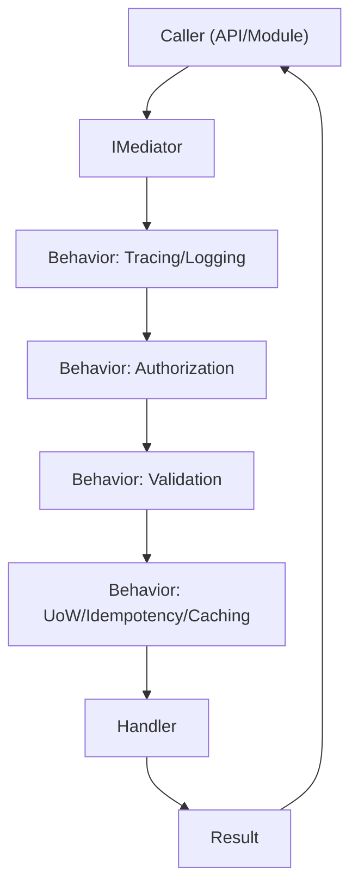
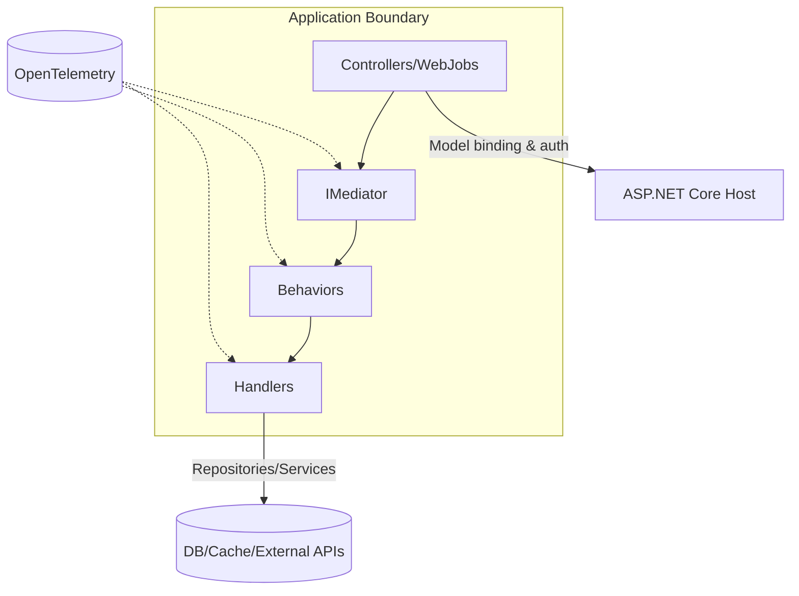
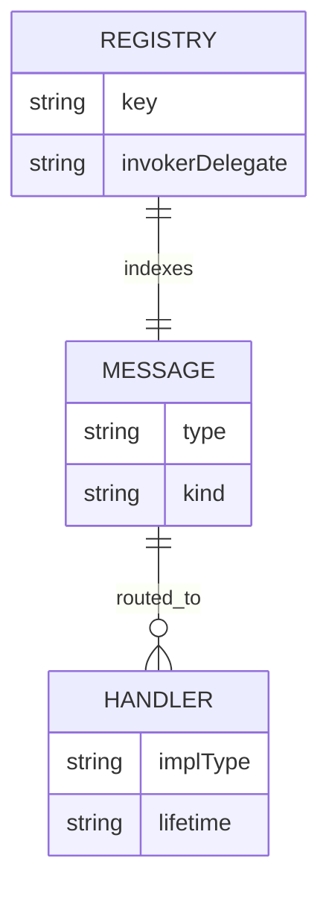
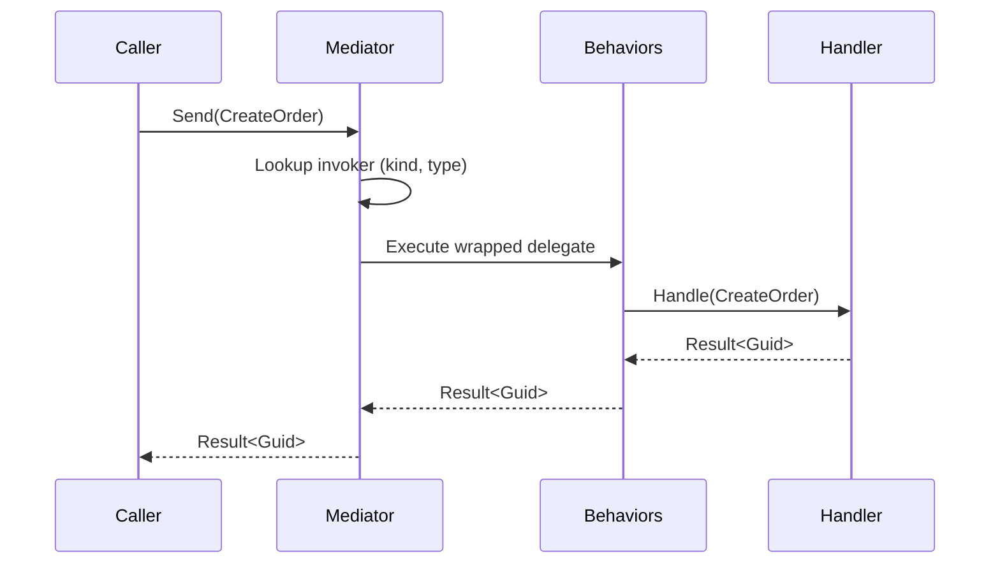
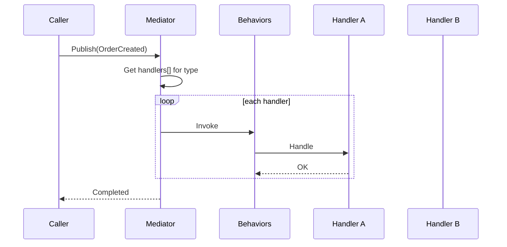
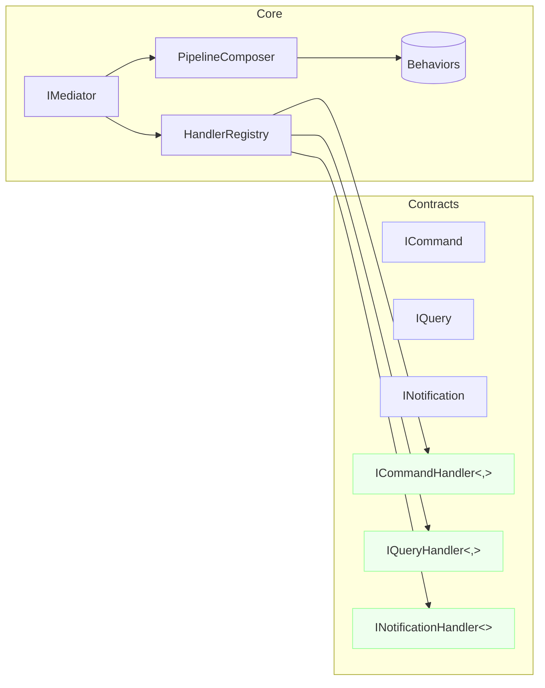
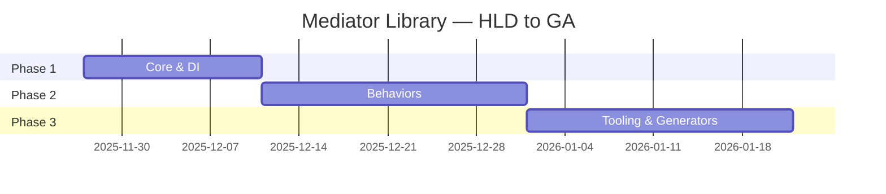

# Teqniqly.Arbiter Mediator Library — High‑Level Design (HLD)

**Version**: 1.0  
**Date**: 2025-11-27  
**Author**: Teqniqly
**Status**: Draft (for review)  
**Related Documents**: Milestone‑1 design & implementation guide; future SDD (to be authored)

## Document History

| Version | Date       | Author   | Changes           |
| ------- | ---------- | -------- | ----------------- |
| 1.0     | 2025-11-27 | Teqnqily | Initial HLD draft |

---

## 1. Executive Summary

This document proposes a lightweight, in‑process mediator library for .NET modular monoliths. The library provides typed, synchronous dispatch of **Commands**, **Queries**, and **Notifications** to decouple modules and standardize cross‑cutting concerns (validation, auth, caching, tracing, metrics, transactions) via a **pipeline behavior** model. The goal: consistent **CQS** semantics, clear module boundaries, excellent observability, and minimal runtime overhead. Deliverables include a core `IMediator`, message/handler abstractions, handler registry with prebuilt invokers, DI integration, and optional behaviors.

**Why now?** Modular monoliths benefit from logical separation without distributed‑systems complexity. Centralizing in‑process communication improves consistency, testability, and evolution of cross‑cutting policies.

**Outcomes**: Faster feature delivery, safer refactors, clear telemetry, simpler reviews, and easier enforcement of CQS and security policies.

---

## 2. Problem Statement & Goals

### 2.1 Problem

Direct module‑to‑module invocations multiply boilerplate and leak cross‑cutting policies into app code. Without a central mediator, validation/auth/logging/metrics/transactions become inconsistent, harder to evolve, and error‑prone.

### 2.2 Goals & Success Criteria

- Typed CQS dispatch with single‑handler semantics for commands/queries; fan‑out for notifications.
- Deterministic, pluggable **pipeline behaviors** for cross‑cutting concerns.
- Clean DI integration; near zero allocations on the hot path; no per‑call reflection.
- Observability hooks (OpenTelemetry) for traces/metrics/logs.
- Testable: handlers are pure application logic; cross‑cuts are in behaviors.
- Backwards‑compatible with common usage (e.g., MediatR‑style patterns).

### 2.3 Out of Scope (for HLD)

- Out‑of‑process transports (service bus/HTTP). Adapters possible later.
- Workflow/saga engines. (Library provides hooks, not orchestration.)

### 2.4 Assumptions

- Target runtime: .NET 8+; DI: `Microsoft.Extensions.DependencyInjection`.
- Default usage in web apps and background services.
- Modules are internal to one solution; message assembly scanning permitted at startup.

---

## 3. Requirements Overview

### 3.1 Functional Requirements (high level)

- Define messages: `ICommand<T>`, `IQuery<T>`, `INotification` (and optional `IStreamQuery<T>` in future).
- Define handlers with `Handle(...)` returning `ValueTask` (or `IAsyncEnumerable<T>` for streaming later).
- Provide `IMediator.Send`, `IMediator.Ask`, `IMediator.Publish` (and `Stream` later).
- Provide handler registry and dispatch with prebuilt invokers, no per‑call reflection.
- Provide optional pipeline behaviors; ensure ordering and short‑circuiting.

### 3.2 Non‑Functional Requirements

- **Performance**: single dictionary lookup + DI resolve + delegate invoke; 95p latency ≤ 1ms in‑process for trivial handlers (assumption).
- **Scalability**: supports many message types; registry immutable & thread‑safe.
- **Security**: authorization behavior, PII‑safe logging, RBAC/permission attributes.
- **Reliability**: idempotency behavior for commands; UoW/transactions; exception handling policy.
- **Operability**: tracing (ActivitySource), metrics (Meters), structured logs, health checks.
- **Portability**: no external runtime deps.

### 3.3 Constraints

- In‑process only; durability requires outbox+broker (optional extension).

---

## 4. Solution Overview

### 4.1 High‑Level Description

A central `IMediator` receives a message and routes it to the single matching handler (or multiple for notifications). A **pipeline** wraps handler execution, layering tracing, auth, validation, idempotency, transactions, caching, and metrics. Startup builds a **registry** keyed by `(kind, message type) → invoker delegate`. Dispatch is reflection‑free.

### 4.2 Key Components (summary)

| Component          | Purpose                                    | Notes                          |
| ------------------ | ------------------------------------------ | ------------------------------ |
| `IMediator`        | Entry point for Send/Ask/Publish           | Scoped lifetime                |
| Message Contracts  | Encode intent (Command/Query/Notification) | Strongly‑typed, serializable   |
| Handlers           | Implement application logic per message    | Exactly one for Command/Query  |
| Handler Registry   | Startup scan → cached invokers             | Immutable at runtime           |
| Pipeline Behaviors | Cross‑cuts (auth/validation/UoW/etc.)      | Ordered, short‑circuit capable |
| Context            | Correlation/Tenant/User/Idempotency        | AsyncLocal accessor            |
| Observability      | Tracing/Metrics/Logs                       | OTel native instruments        |

### 4.3 Architecture Diagram



### 4.4 Assumptions

- Behaviors implemented as open generics; composed once per message type and cached.
- Context flows via AsyncLocal provider set by hosting middleware/background job wrapper.

---

## 5. System Context



**Actors**: API controllers/background services (callers), infra (DB/cache/external), observability stack.

---

## 6. Data & Contracts (Conceptual)

### 6.1 Result & Error Pattern

- `Result<T>` conveys domain outcomes without exceptions; behaviors may map exceptions → failures.
- Standard error codes: `validation_failed`, `forbidden`, `not_found`, `conflict`, `concurrency_conflict`, `transient_failure`.

### 6.2 Minimal ER (conceptual) — Library Data



_Assumption_: Registry is in‑memory only; no persistent data model.

---

## 7. Critical Workflows

### 7.1 Command Dispatch Sequence



### 7.2 Notification Publish (fan‑out)



_Assumption_: Default publish mode is inline; buffered/parallel variants are optional.

---

## 8. Component Architecture



**Key:** `HandlerRegistry` maps message → invoker; `PipelineComposer` builds ordered chain once per type.

---

## 9. Technology Stack (assumed)

| Area             | Choice                                     | Notes                  |
| ---------------- | ------------------------------------------ | ---------------------- |
| Language/Runtime | C# / .NET 8+                               | Native OTel support    |
| DI               | `Microsoft.Extensions.DependencyInjection` | Built‑in               |
| Logging          | Microsoft.Extensions.Logging               | Structured             |
| Tracing/Metrics  | OpenTelemetry                              | ActivitySource/Meters  |
| Testing          | xUnit, NSubstitute                         |                        |
| Packaging        | NuGet                                      | Multi‑target if needed |

---

## 10. Security, Compliance, Observability

### 10.1 Security

- Authorization behavior enforces permission attributes on messages/handlers.
- Sensitive data excluded from logs by default (opt‑in redaction policy).

### 10.2 Observability

- Activity per message; tags for `message.type`, `kind`, `tenant`, `correlation_id`, `outcome`.
- Metrics: duration histograms, success/failure counters, in‑flight gauge.

### 10.3 Assumptions

- Hosting layer injects `MessageContext` (correlation/tenant/user) per request/job.

---

## 11. Scalability & Performance

- Immutable registries; lock‑free read access (dictionary lookups are concurrent‑safe for reads).
- ValueTask on hot paths; no per‑call reflection.
- Behaviors should avoid expensive work unless required (e.g., skip validation if no validators).

Risks: too many behaviors can add latency; mitigate with profiling, ordering, and short‑circuiting.

---

## 12. Deployment & Operations

- Delivered as a NuGet package; consumed by apps at build time.
- No runtime infra required; observability depends on host’s OTel exporter.
- Versioning: semantic versioning; changelog; analyzer compatibility notes.

---

## 13. Risks, Alternatives, Trade‑offs

| Area              | Choice              | Trade‑off            | Alternative                 |
| ----------------- | ------------------- | -------------------- | --------------------------- |
| In‑process only   | Simpler & fast      | No durability        | Outbox + broker adapter     |
| Behavior pipeline | Powerful & uniform  | Added latency        | Inline policies in handlers |
| Startup scanning  | One‑time reflection | Longer startup       | Source generator registry   |
| CQS strictness    | Clear semantics     | More message classes | Single IRequest model       |

---

## 14. Implementation Approach (Phased)

- **Phase 1 (Core)**: abstractions, mediator, registry, DI, minimal tests.
- **Phase 2 (Behaviors)**: tracing/logging, validation, auth, UoW, idempotency, caching, metrics.
- **Phase 3 (Extras)**: streaming queries, buffered/parallel publish, analyzers, source generator.



---

## 15. Open Questions & Next Steps

- Do we ship default behaviors or keep the core minimal and publish behaviors as sub‑packages?
- Adopt source generator now or later?
- Provide MediatR compatibility shim?

**Next Steps**: Review; confirm behavior list and ordering; begin SDD with API, threading model, examples, and benchmarks.

---

## Appendix A — API Sketch (Non‑binding)

```csharp
public interface IMediator
{
    ValueTask<TResult> Send<TResult>(ICommand<TResult> command, CancellationToken ct = default);
    ValueTask<TResult> Ask<TResult>(IQuery<TResult> query, CancellationToken ct = default);
    ValueTask Publish<T>(T notification, CancellationToken ct = default) where T : INotification;
}
```

```csharp
public interface ICommandHandler<TCommand, TResult>
 where TCommand : ICommand<TResult>
{
    ValueTask<TResult> Handle(TCommand command, CancellationToken ct);
}
```

---

## Appendix B — HLD Methodology References

- This HLD follows a concise, stakeholder‑friendly structure emphasizing purpose, outcomes, and conceptual architecture over detailed implementation. It uses Mermaid for diagrams to ease iteration and versioning.
